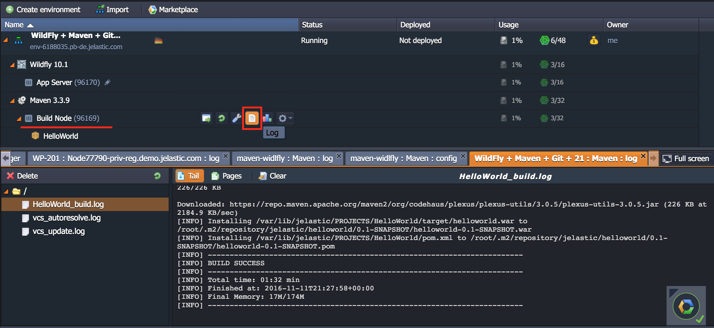
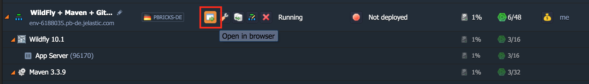

# WildFly Continuous Deployment Package 

#### 1 - Press Deploy button 
And choose a service provider after redirection to Jelasic Cloud Union.

 

#### 2 - Confirm installation 
Here you can specify path to your git repo and change env name, it will be your application domain.

#### 3 - Wait for successful deployment

#### 4 - Wait, Maven downloads dependencies 
The first time application deployment takes longer. You can check the status via Log button.  

After this point your application should be deployed and ready to handle requests. 

#### 5 - Open in browser

#### 6 - Edit deployment settings

Any feedback or questions? <a href="mailto:info@jelastic.com">Drop us a message</a>. 

